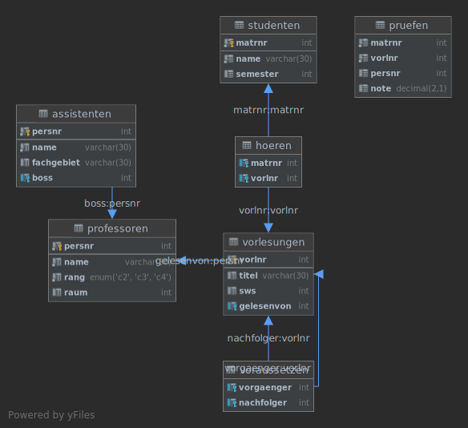

# Datenbanken Kurs

## Übungsdatenbank

Für einige Übungen wird eine Datenbank mit Beispieldaten gebraucht. Da dieses aber in einem komischen SQL Dialekt ist,
haben wir auch die Möglichkeit, unsere eigene Datenbank, z.B. mit MySQL/MariaDB zu benutzen.

Um das zu vereinfachen stelle ich hier eine öffentliche Datenbank Instanz zum bearbeiten der Übungen zur Verfügung.
(Oder mit Docker lokal installiert kann man auch das Repository klonen und mit `startDatabase.sh` eine eigene Instanz
starten)

### Wie benutze ich die Datenbank?

|||
| ---  | --- |
| JDBC Url | `jdbc:mysql://uebungsdb.moritz.website:1337/uebungen?user=student&password=SehrSicher` |
| Host | `uebungsdb.moritz.website` |
| Port | `1337` |
| Datenbank Name | `uebungen` |
| Benutzername | `student` |
| Passwort | `SehrSicher` |
| Datenbanktyp | MySQL Version 8 |

**Wichtig**: Der Benutzer student hat Schreibrechte für die Datenbank, in späteren Aufgaben wird ein `CREATE`, `INSERT`
usw. also trotzdem funktionieren, es wäre aber nett, wenn die Namen für eigene Tabellen einen Prefix enthalten, wie
z.B. `mein_tabellen_name` -> `moritz_mein_tabellen_name`. Nicht vergessen den Prefix im SQL für die Abgabe aber wieder
zu entfernen.

Und, um eine überfüllte Datenbank zu vermeiden, resettet sich die öffentliche Datenbank jeden morgen um 04:00 Uhr.

#### Mit IntelliJ DataGrip

1. Öffnen und im `Datenbanken` Tab eine neue Datenbank/Data Source hinzufügen
2. In der Liste der Datenbanktypen MySQL auswählen.
3. In das `URL` Feld die JDBC Url einfügen, was automatisch alle Felder richtig eintragen müsste.
4. Fertig!

(Ich würde DataGrip empfehlen, sehr angenehm zu benutzen, hat Unterstützung und Plugins für praktisch alles und ist für
Studenten auch kostenlos!)

#### Mit MySQL Workbench

1. Auf der Startseite auf das `+` neben MySQL Verbindungen, um eine neue hinzuzufügen
2. Einen guten Namen oben eingeben.
3. Die Felder manuell mit den Informationen aus der Tabelle oben ausfüllen.
4. Fertig.

#### Lokal mit Docker

Das kleine Helfer Skript ist nur für Linux gedacht. Auf Windows und Mac müsste es wohl auch funktionieren, dafür musst
du dann dir selber raussuchen, wie du Docker zum laufen bekommst und docker-compose installierst.

Auf Linux:

1. Docker installieren: [docs.docker.com/engine/install](https://docs.docker.com/engine/install/#server)
2. Docker-Compose installieren: [docs.docker.com/compose/install](https://docs.docker.com/compose/install)
3. `startDatabase.sh` Skript aus diesem Ordner ausführen.
4. Kurz warten und fertig!

### Irgendwelche Probleme, Fragen, irgendwas anderes?

Ich bin auf Discord als `Kage0x3B#2280` zu erreichen!

### Datenbank Diagramm

(Da ich die SQL Skripte zum erstellen der Datenbank fast exakt übernommen habe von den vom Professor bereitgestellten,
fehlen einige Foreign Key Verbindungen)